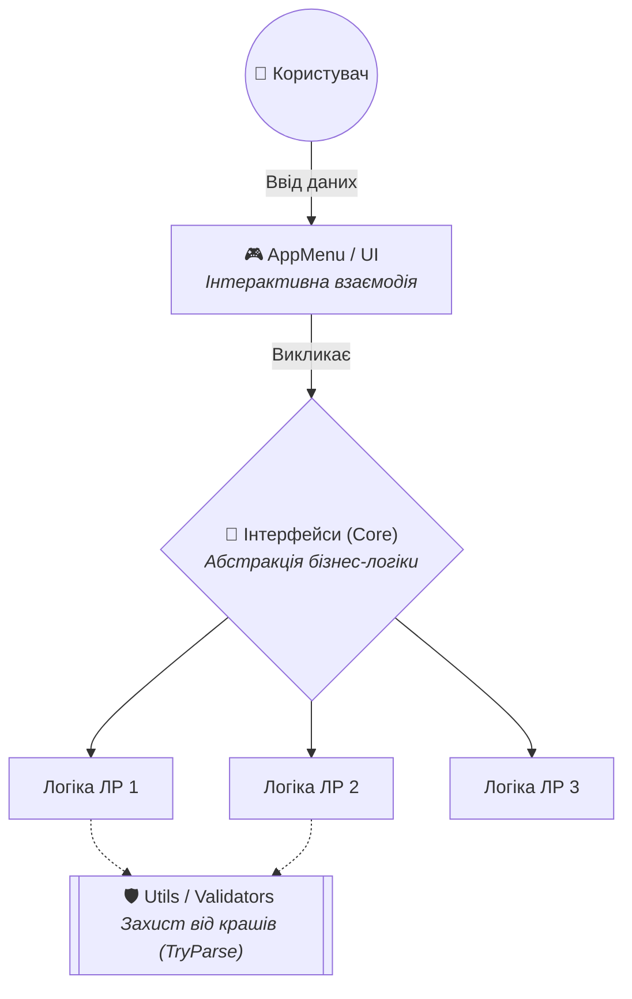

<div align="center">

  

  # 💻 Об'єктно-орієнтоване програмування (C#)

  **Репозиторій для сирцевого коду, звітів та архітектурних рішень з навчальної дисципліни «Об'єктно-орієнтоване програмування».**

  [](https://learn.microsoft.com/en-us/dotnet/csharp/)
  [](https://dotnet.microsoft.com/)
  [](#)
  [](#)

</div>

---

## 👤 Інформація про розробника

> 🎓 **Здобувач освіти:** Лукащук Данило Миколайович  
> 👥 **Група:** ІПЗ-32  
> 💻 **Спеціальність:** 121 «Інженерія програмного забезпечення»  
> 📅 **Семестр:** Осінь 2026  

---

## 🧪 Навігація по лабораторних роботах

Проєкти розробляються з поступовим ускладненням архітектури: від базових консольних застосунків до складних систем з інтерфейсами та обробкою винятків.

| № | Тема лабораторної роботи | Годин | Статус | 
| :---: | :--- | :---: | :---: | 
| **01** | [Розробка консольних застосунків мовою C#](Lab01/) | 8 год | `Виконано` ✅ | 
| **02** | Робота з класами і методами класів | 4 год | `Заплановано` 📅 |
| **03** | Використання принципів ООП та інтерфейсів | 8 год | `Заплановано` 📅 | 
| **04** | Контроль доступу до даних | 2 год | `Заплановано` 📅 | 
| **05** | Обробка винятків | 2 год | `Заплановано` 📅 | 

---

## 📂 Структура репозиторію

Кожна лабораторна робота виділена в окремий ізольований проєкт (Solution/Project) зі своєю внутрішньою архітектурою.

```text
OOP_Labs/
├── Lab01/                     # 🚀 ЛР 1: Консольні застосунки (f(x), LINQ, BigInteger)
│   ├── Core/                  # Базові абстракції (ITask.cs)
│   ├── Tasks/                 # Ізольована логіка кожного завдання
│   ├── Utils/                 # Утиліти (InputValidator)
│   └── Program.cs             # Точка входу
├── Lab02/                     # ⏳ ЛР 2: Класи та методи (В процесі розробки)
├── Lab03/                     # 📅 ЛР 3: Інтерфейси
└── README.md                  # 📖 Головна навігаційна картка репозиторію

```

---

## 🏗 Базова архітектура рішень

Усі роботи базуються на принципах **SOLID** та чистої архітектури. Навіть базові консольні меню відокремлені від бізнес-логіки завдяки патернам проєктування.



---

## 🛠️ Стек технологій та інструменти

| Категорія | Технології | Обґрунтування |
| --- | --- | --- |
| **Платформа** | `C# 12`, `.NET 8/10` | Сувора типізація, сучасний синтаксис, висока швидкодія. |
| **Обробка даних** | `System.Linq` | Декларативний підхід до роботи з колекціями (фільтрація, екстремуми). |
| **Архітектура** | `OOP`, `Interfaces` | Ізоляція коду, інкапсуляція, поліморфізм, використання патернів. |
| **Безпека** | `Exception Handling` | Захист пам'яті (BigInteger) та безпечний парсинг (TryParse) без збоїв. |

---

## 🚀 Як запустити будь-яку лабораторну

Проєкти не потребують складного налаштування і працюють на Windows, macOS та Linux (Arch).

**1. Клонування репозиторію**

```bash
git clone [https://github.com/DanyloLyk/OOP.git](https://github.com/DanyloLyk/OOP.git)
cd OOP

```

**2. Запуск конкретної лабораторної**
Перейдіть у папку потрібної роботи (наприклад, Lab01) і запустіть її:

```bash
cd Lab01
dotnet run

```

> *Примітка:* Для коректного відображення псевдографіки переконайтеся, що ваш термінал підтримує кодування UTF-8.

---

*Виконав: здобувач освіти групи ІПЗ-32, Лукащук Данило*


